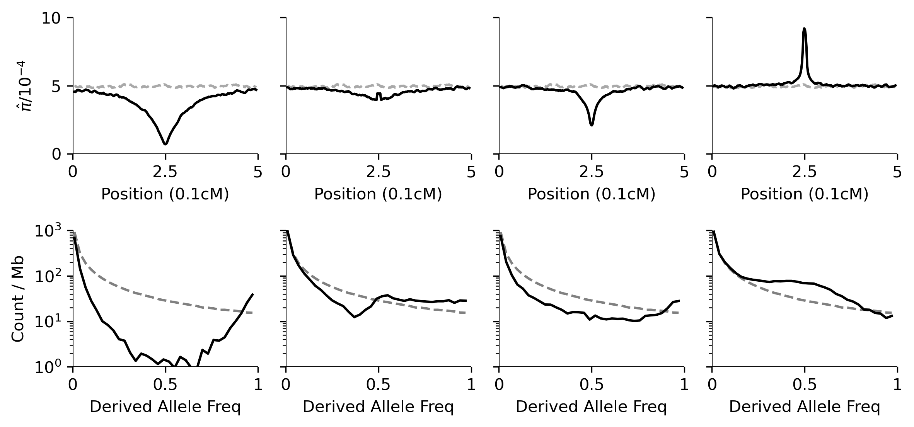

## Local footprints of natural selection
This repo hosts scripts used to replicate simulation and visualization for Fig3 in the review "_Genomic Scans for Demography and Natural Selection_"

### Set-up

All the scripts are only tested on Linux/Unix OS. Scripts assume that [SLiM v4](https://messerlab.org/slim/) has been installed and can be called by `slim` on the command line. To ensure it will run, before running simulations, please specify the  absolute path to the SLiM executable in line  

These scripts depend on python packages `numpy`, `scipy`, `tskit`, `pandas`, and `matplotlib.pyplot`.

### Step 0: Generate SLiM simulations and compute window-based summaries

The top row on the figure was generated from genetic diversity computed from 1000 replicates with 10kb sliding windows (step size 2kb). To generate simulations and summaries with the same settings, run

```shell
$ ## General usage for the script:
$ ## python Slim_and_stats.py <num_reps> <cond> <slim_vars> <win_size/bp> 
$ # Neutral
$ python step0_Slim_and_stats.py 1000 Neut "-d var_s=0" 1e4
$
$ # full sweep of s=0.01, additive/semi-dominant, stop when allele fixes
$ python step0_Slim_and_stats.py 1000 fullSweep_s.01_h.5 "-d var_s=0.01 -d var_h=0.5" 1e4
$
$ # partial sweep of s=0.01, additive/semi-dominant, stop when frequency reaches 0.5
$ python step0_Slim_and_stats.py 1000 partialSweep.5_s.01_h.5 "-d var_s=0.01 -d var_h=0.5 -d var_freq=0.5" 1e4
$
$ # sweep of s=0.01 on standing variation with freq >=0.1, additive/semi-dominant, stop when fixed.
$ python step0_Slim_and_stats.py 1000 fullSweep_stdVar.1_s.01_h.5 "-d var_s=0.01 -d var_h=0.5 -d var_freq=0.1" 1e4
$
$ # over-dominance (balancing selection) of s=1e-5, h=100, lasting for 8Ne = 8e4 generations.
$ python step0_Slim_and_stats.py 1000 8NeAgo_s1e-5_h100 "-d var_s=0.01 -d var_h=0.5" 1e4
```

As we did not use recapitation, these simulations will take hours (if not days) to finish. Each command will generate file folders with corresponding names, and write out the summaries to `f'{cond}_rep0-999_win10kb_step2kb_SFS-n-summaries.pkl`, which will be the file names the subsequent plotting scripts are based on. If the user intends to use different specs, please make sure to change the file names recorded in the variable `PklFiles` in subsequent scripts.

### Step 1: Plot mean genetic diversity and site-frequency spectra (top two rows)

To plot mean genetic diversity (Tajima's $\pi$) and SFS, that is, the top two rows of the figure, run
```shell
$ # usage: python step1_plot_summaries_n_SFS.py <figname> <winSize> <sfs_segSize>
$ python step1_plot_summaries_n_SFS.py s01_summaries-n-SFSs_top2rows.png 10kb 2e4
```
This command will create the plot below (in `images/s01_summaries-n-SFSs_top2rows.png`).




Again, this script assumes the pre-computed stats are saved in `f'{cond}_rep0-999_win10kb_step2kb_SFS-n-summaries.pkl`. To modify the filenames, please modify the `PklFiles` variable on line 120 of this script.
### Step 2: Plot haplotype frequency (third row)

To generate haplotype frequency spectra, run
```shell
$ # usage: python step2_count_n_plot_haps.py <segment_size/bp> <sample_size> <#top haps> <seed> <fig_prefix>
$ python step2_count_n_plot_haps.py 1e4 100 8 12345 ""
```
This script requires the existence of _ms_-formatted outputs of the 1000 replicates in each of the scenarios simulated previously. It will randomly sample `<sample_size>` haplotypes with seed `<seed>` and truncate the center `<segment_size>`bp sequence of each haplotype. Within each replicate, these haplotypes will then be sorted and tallied, generating a descending list of counts for each unique haplotype. These vectors will then be summed up across all replicates.

Along with the HFS bar plot for the top `<K>` most common haplotypes, this script will also record and write out the total haplotype counts and the number of segregating sites within the center window analysed for each replicate. It will produce an additional plot that shows the histograms of the number of segregating sites for each scenario simulated (not shown in paper).

### Step 3: Sort Tmrca of the center trees and plot the replicate with median height (bottom row)

To plot the genealogical tree for each of the simulated scenario whose tree height (T<sub>MRCA</sub>) is the median among those of all replicates, run:

```shell
$ # loop through all scenarios, using sampling seed 123
$ for cond in {"Neut","FS-01","PS-01","stVar-01","BS-01"}; do
$    python step3_sort_center_trees.py $cond 123
$ done
```

Similar to the previous step, this script assumes that the `.trees` output for all 1000 replicates exist for all scenarios considered. For each replicate, if the scenario is non-neutral, it will identify the position of the target locus, extract the local genealogical tree, and record its "root age". After root ages of all replicates have been recorded, the script will plot the tree that has the median root age.

Subsequent styling and assembling of these trees was done in InkScape.
